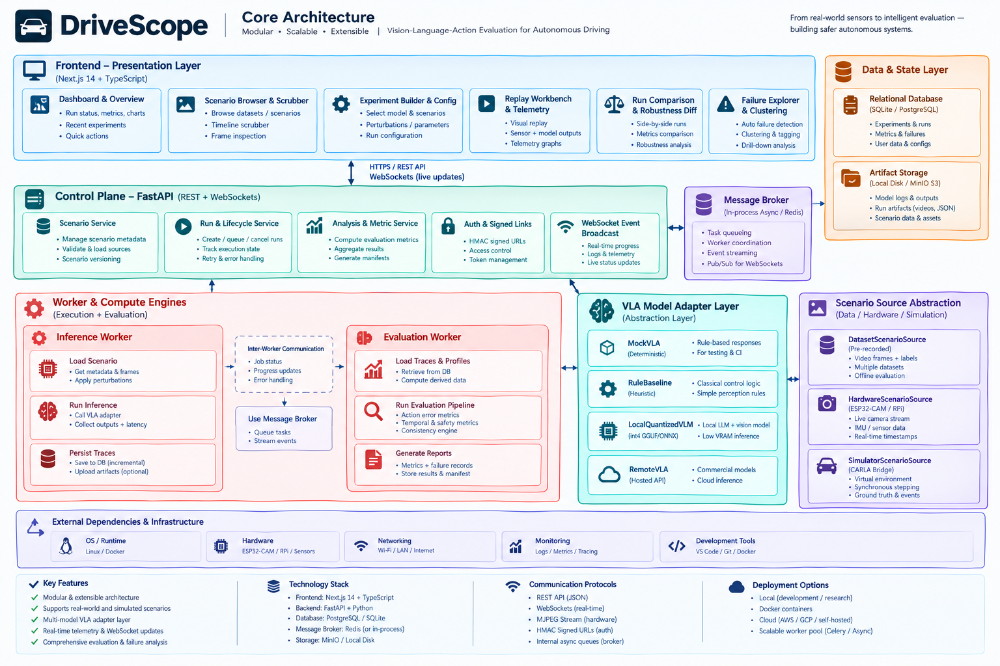
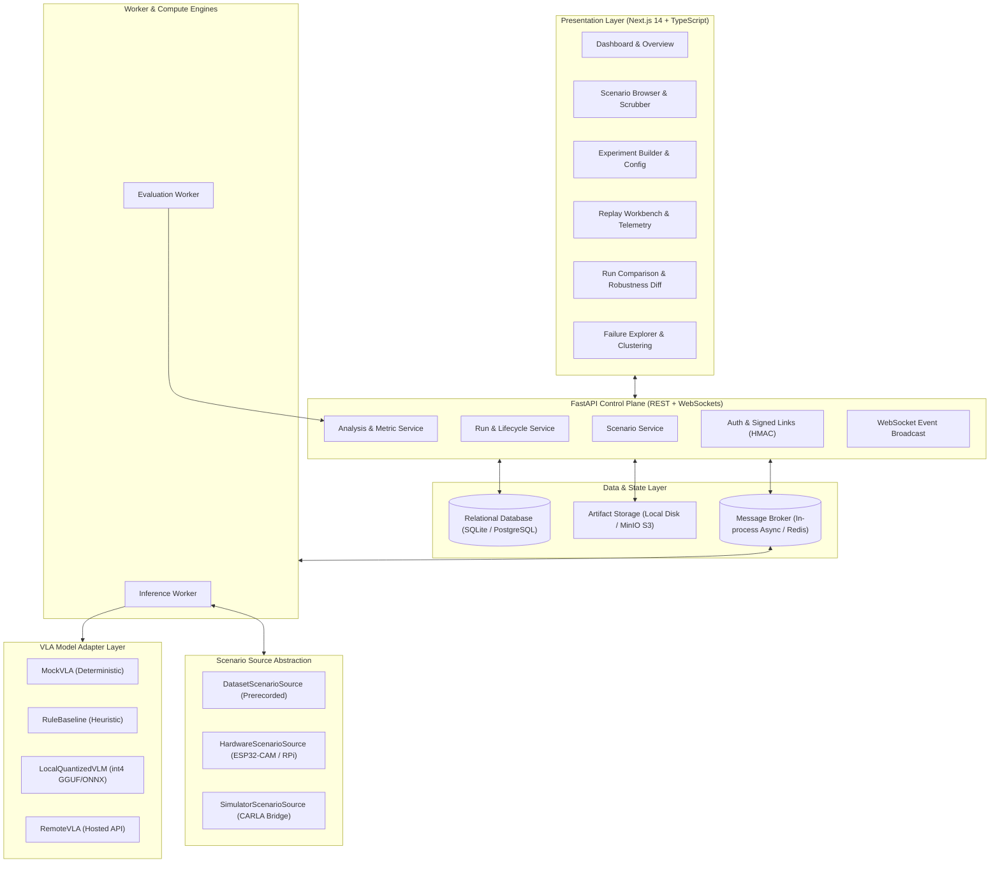
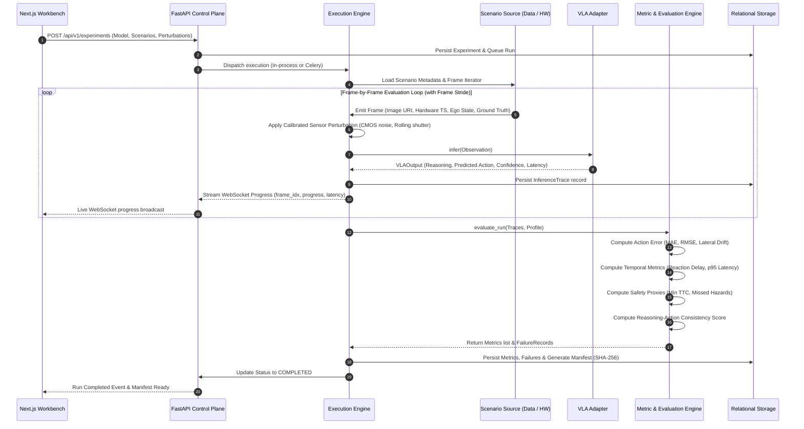
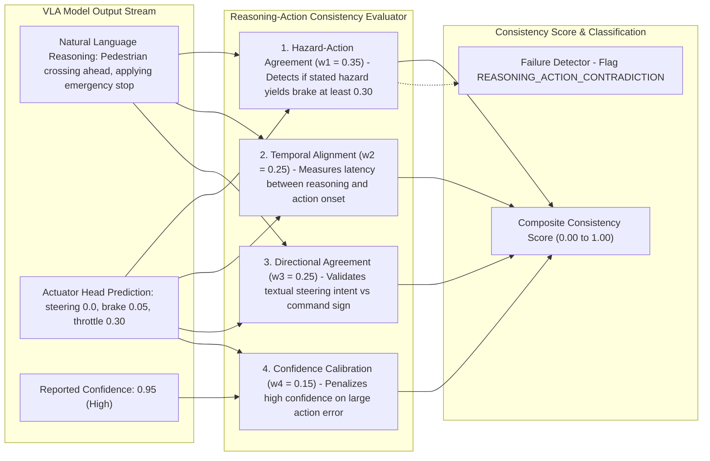
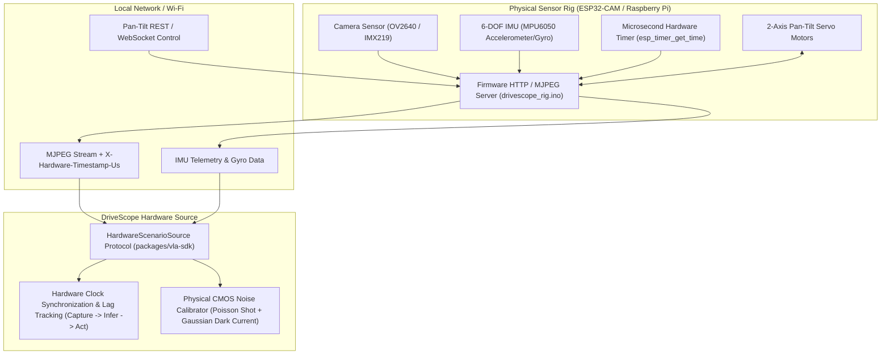
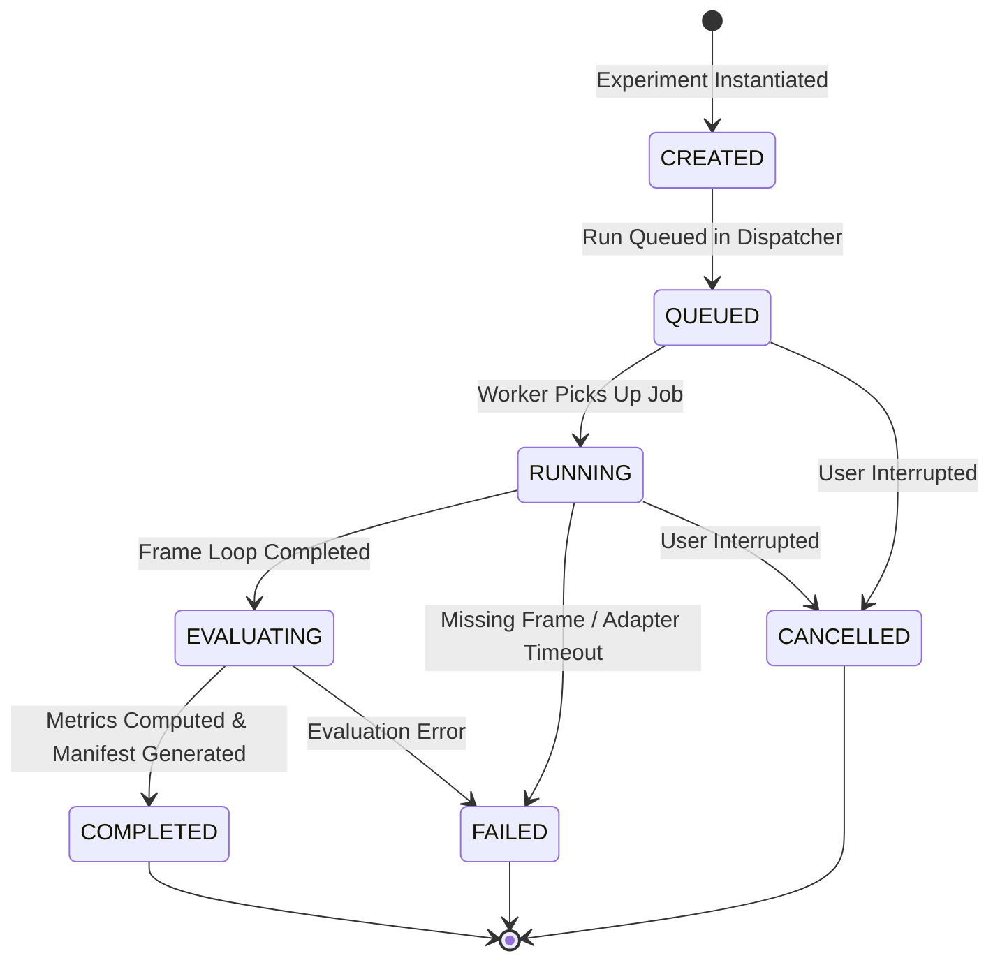
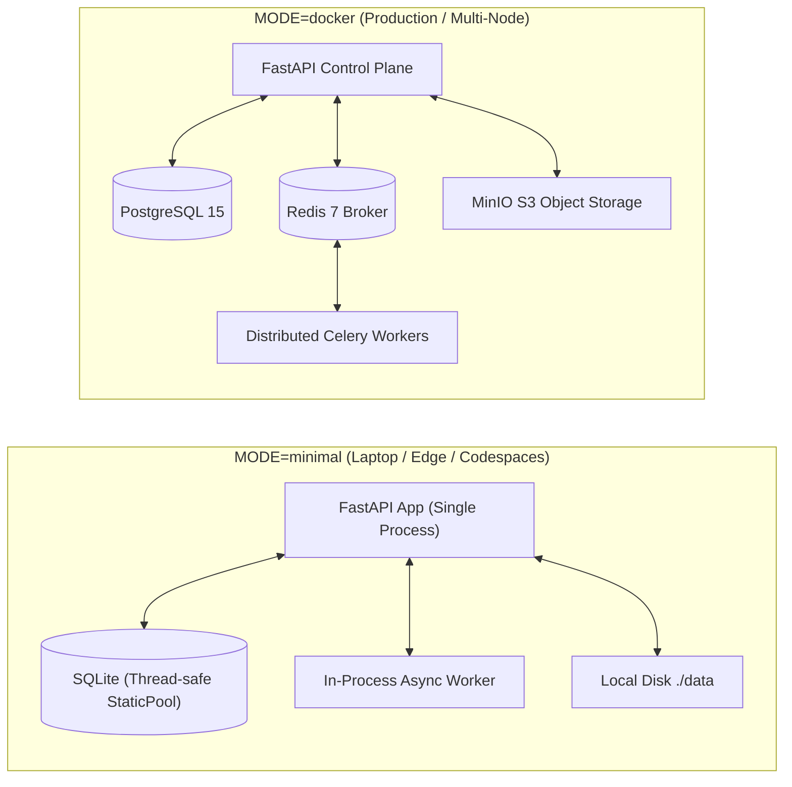
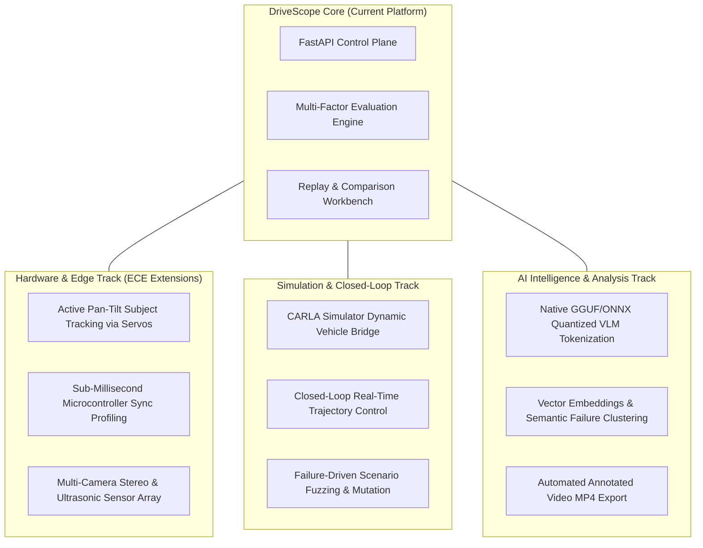

# DriveScope

**Experiment & Evaluation Infrastructure for Vision-Language-Action (VLA) Foundation Models.**

DriveScope is an open-source experimentation, evaluation, and failure-analysis platform for Vision-Language-Action (VLA) models and physical-AI driving agents. It provides a reproducible evaluation layer sitting around scenario sequences, camera observations, model inference heads, reasoning traces, metric evaluations, physical sensor perturbations, and failure intelligence.

[](https://github.com/paul-abhirup/DriveScope/actions/workflows/ci.yml)
[](LICENSE)
[](pyproject.toml)
[](apps/web)
[](docs/architecture.md)

---

## Table of Contents

1. [Executive Summary](#executive-summary)
2. [Core Architecture](#core-architecture)
3. [End-to-End Evaluation Dataflow](#end-to-end-evaluation-dataflow)
4. [Reasoning-Action Consistency Engine](#reasoning-action-consistency-engine)
5. [Hardware-in-the-Loop & Physical Sensor Rig (ECE Core)](#hardware-in-the-loop--physical-sensor-rig-ece-core)
6. [Run Lifecycle State Machine](#run-lifecycle-state-machine)
7. [Pluggable Model Adapters & Quantized CPU Path](#pluggable-model-adapters--quantized-cpu-path)
8. [Dual Execution Modes](#dual-execution-modes)
9. [Quickstart Guide](#quickstart-guide)
10. [Repository Structure](#repository-structure)
11. [Future Scope & Planned Extensions](#future-scope--planned-extensions)
12. [Testing & Quality Verification](#testing--quality-verification)
13. [Project Motivation & Interview Defense Guide](docs/project_motivation_and_interview_guide.md)
14. [License](#license)

---

## Executive Summary

Evaluating Vision-Language-Action (VLA) agents requires more than eyeballing demo videos or computing offline loss metrics. A robust VLA evaluation layer must answer:
1. **Did the model do the right thing?** (Action MAE/RMSE, steering drift, brake force calibration).
2. **Did the model reason correctly, and did its action match that reasoning?** (Reasoning-Action Consistency).
3. **How robust is the decision when real physical sensors degrade?** (CMOS noise, rolling shutter, glare, frame drops).
4. **How fast did the model react?** (Hardware capture timestamp $\rightarrow$ inference latency $\rightarrow$ actuator lag).
5. **Can this exact result be reproduced on any machine?** (Deterministic seeds, immutable manifests, config hashes).

DriveScope decouples the **evaluation and experiment orchestrator** from the **scenario source** (datasets, live sensor rigs, CARLA simulators) and the **model implementation** (mock generators, rule baselines, quantized local VLMs, remote hosted APIs).

---

## Core Architecture

<p align="center">
  
</p>



---

## End-to-End Evaluation Dataflow



---

## Reasoning-Action Consistency Engine

A critical failure mode in Vision-Language-Action foundation models is **semantic dissociation** — where the natural language chain-of-thought correctly identifies a hazard ("pedestrian crossing from right curb"), but the action output head fails to actuate the brake or continues commanding throttle.



### Mathematical Formulation

$$\text{Consistency} = w_1 \cdot S_{\text{hazard}} + w_2 \cdot S_{\text{temp}} + w_3 \cdot S_{\text{dir}} + w_4 \cdot S_{\text{conf}}$$

- **$S_{\text{hazard}}$ (Hazard-Action Agreement)**: Verifies if verbal hazard identification induces braking ($\text{brake} \ge 0.30$).
- **$S_{\text{dir}}$ (Directional Agreement)**: Verifies if lateral intent ("turn left", "steer right") matches steering sign and angle.
- **$S_{\text{temp}}$ (Temporal Alignment)**: Evaluates the frame latency between verbal realization and control onset.
- **$S_{\text{conf}}$ (Confidence Calibration)**: Penalizes overconfident predictions that exhibit severe error or miss hazards.

---

## Hardware-in-the-Loop & Physical Sensor Rig (ECE Core)

DriveScope bridges pure software experimentation with real-world electronics and sensor physics. It integrates directly with physical camera sensor rigs (ESP32-CAM, Raspberry Pi Camera module) mounted on 2-axis Pan-Tilt servos.



### Calibrated Physical Noise Models
Rather than only applying synthetic filters, DriveScope incorporates measured physical noise profiles:
- **CMOS Photon Shot Noise**: Modeled via Poisson distributions parameterized by illuminance and sensor gain.
- **Dark Current / Read Noise**: Gaussian thermal noise from camera sensor readout circuits.
- **Rolling Shutter Distortion**: Progressive scanline horizontal skew caused by sensor line-readout delay during platform vibration.

---

## Run Lifecycle State Machine



---

## Pluggable Model Adapters & Quantized CPU Path

DriveScope enforces strict boundary contracts for all models via the `VLAAdapter` protocol:

| Adapter | Architecture | Execution Engine | Primary Use Case |
|---|---|---|---|
| **`MockVLA`** | Synthetic Deterministic Generator | Pure Python / CPU | CI/CD testing, reproducibility baselines, anomaly injection |
| **`RuleBaseline`** | Classical Control Heuristics | Pure Python / CPU | Interpretable rule baseline for speed regulation and braking |
| **`LocalQuantizedVLM`** | SmolVLM2 (256M / 500M / 2.2B) | int4/int8 GGUF via llama.cpp `MTMDChatHandler` + JSON-schema grammar | True local CPU multimodal inference without GPUs (heuristic fallback offline) |
| **`RemoteVLAAdapter`** | OpenAI / Anthropic / Custom endpoints | HTTP / REST API | Large hosted multimodal frontier models |
| **`SimulatorBridge`** *(Planned)* | CARLA / Unreal Engine Bridge | Python API / RPC | Closed-loop dynamic vehicle physics testing |

---

## Dual Execution Modes

DriveScope is built to run on weak hardware (like laptops and Raspberry Pis) without sacrificing enterprise-grade distributed scaling:



---

## Quickstart Guide

### Option 1: Minimal Mode (Ultra-Portable, Zero Docker, ~250 MB RAM)

```bash
# 1. Clone the repository
git clone https://github.com/paul-abhirup/DriveScope.git
cd DriveScope

# 2. Install dependencies & packages in editable mode
pip install -r requirements.txt
pip install -e packages/scenario-schema
pip install -e packages/vla-sdk

# 3. Generate sample benchmark dataset
python data/generate_demo_data.py

# 4. (Optional) Download quantized VLM weights + install llama-cpp backend for real local inference
pip install llama-cpp-python
./scripts/download_models.sh --model smolvlm-2.2b --quant q4_k_m   # → ./weights/

# 5. Start FastAPI Control Plane in minimal mode
MODE=minimal uvicorn services.api.main:app --reload --port 8000
```

In a second terminal, start the Next.js frontend:

```bash
cd apps/web
npm install
npm run dev
```

Visit [`http://localhost:3000`](http://localhost:3000) to open the DriveScope Workbench.

---

### Option 2: Full Distributed Stack (Docker Compose)

```bash
docker compose -f infra/docker-compose.yml up --build
```

This starts Next.js (port 3000), FastAPI (port 8000), PostgreSQL (port 5432), Redis (port 6379), MinIO (port 9000/9001), and Celery worker.

---

<!-- ## Repository Structure

```
DriveScope/
├── apps/
│   └── web/                         # Next.js 14 App Router (TypeScript + Tailwind)
│       ├── src/app/                 # Dashboard, Scenarios, Builder, Replay, Compare, Failures
│       ├── src/components/          # Navbar, MetricCard, StatusBadge, Timeline
│       └── src/lib/api.ts           # Typed API Client
├── packages/
│   ├── scenario-schema/             # Shared Pydantic data models & contracts
│   │   └── drivescope_schema/       # Scenario, Observation, VLAOutput, Trace, Metric, Failure, Manifest
│   └── vla-sdk/                     # ScenarioSource & VLAAdapter protocol interfaces
│       └── drivescope_vla_sdk/      # DatasetScenarioSource, HardwareScenarioSource
├── models/
│   └── adapters/                    # Model Adapter implementations
│       ├── base.py                  # BaseVLAAdapter class
│       ├── mock.py                  # Deterministic MockVLA (seedable synthetic generator)
│       ├── rule_baseline.py         # Heuristic rule-based driving baseline
│       ├── local_small_vlm.py       # Quantized Small VLM (GGUF / ONNX on CPU)
│       ├── remote.py                # Hosted API / Remote multimodal adapter
│       └── registry.py              # Adapter registry & health probes
├── evaluation/                      # Multi-dimensional Evaluation Suite
│   ├── action.py                    # Steering/brake/throttle MAE, RMSE, cumulative drift
│   ├── temporal.py                  # Mean/p95 latency, hazard reaction delay
│   ├── safety.py                    # Time-to-Collision (TTC) breaches, missed hazards
│   ├── reasoning.py                 # Multi-factor Reasoning-Action Consistency scoring
│   ├── perturbation.py              # Calibrated CMOS noise, rolling shutter, blur, exposure, frame drop
│   ├── robustness.py                # Metric degradation slopes & delta analysis
│   └── engine.py                    # Central EvaluationEngine orchestrator
├── hardware/
│   └── esp32_cam/                   # Physical sensor rig Arduino firmware (MJPEG + Hardware Timestamps + Servos)
├── data/
│   ├── manifests/                   # demo_scenarios_manifest.json
│   ├── sample/scenarios/            # Curated benchmark test sequences with frame data & ground truth
│   └── generate_demo_data.py        # Scenario suite generator
├── infra/
│   ├── docker-compose.yml           # Multi-service stack (Web, API, Worker, Postgres, Redis, MinIO)
│   ├── Dockerfile.api               # API container
│   ├── Dockerfile.worker            # Worker container
│   └── Dockerfile.web               # Next.js web container
├── docs/
│   ├── architecture.md              # System design & execution flows
│   ├── references.md                # Research citations & physical AI foundations
│   ├── adr/                         # Architecture Decision Records (ADR 0001 - 0005)
│   ├── project_motivation_and_interview_guide.md # Motivation, ECE relevance & CTO questions
│   └── research-notes/              # Reasoning-action consistency mathematical formulation
├── tests/
│   ├── unit/                        # Tests for schemas, adapters, evaluations, perturbations
│   ├── api/                         # API endpoint tests & full lifecycle integration tests
│   └── reproducibility/             # Deterministic seed reproducibility validation
├── .github/workflows/ci.yml         # Automated GitHub Actions CI/CD Pipeline
├── TODO.md                          # Interactive task checklist and future milestone tracker
├── pyproject.toml / requirements.txt
└── .env.example / .gitignore
```

--- -->

## Future Scope & Planned Extensions



### 1. Closed-Loop Simulator Bridge (`CarlaScenarioSource`)
- Bidirectional bridge with CARLA simulator where VLA actuator commands (`steering`, `brake`, `throttle`) drive vehicle physics in real-time.
- Supports closed-loop evaluation where decisions alter subsequent observations.

### 2. Failure-Driven Scenario Fuzzing & Mutation
- Mutation engine that generates parameter variations around identified failure cases (e.g. altering rain intensity, shifting pedestrian crossing speed, or adding glare at the exact failure timestep).

### 3. High-Dimensional Failure Clustering (Vector Embeddings)
- Sentence transformer embeddings for natural language reasoning coupled with action error tensors.
- UMAP / $t$-SNE projection maps in the Next.js Failure Explorer to identify semantic clusters of failure modes automatically.

### 4. Video Rendering & MP4 Telemetry Export
- Backend video compositor overlaying dynamic telemetry HUDs (steering wheel gauges, brake pressure indicators, reasoning subtitle overlays, and TTC warning boxes) into shareable MP4 video packages.

### 5. Multi-Sensor Array Hardware Rig
- Expansion of the ESP32-CAM setup to a stereo camera rig + time-of-flight (ToF) distance sensor + 6-DOF IMU for multi-sensor fusion evaluation.

---

## Testing & Quality Verification

DriveScope maintains a comprehensive test suite across unit calculations, API endpoints, and reproducibility:

```bash
# Run all tests
pytest tests/ -v
```

### Verified Test Gates:
- ✅ **Deterministic Seed Reproducibility**: Matching seeds guarantee byte-identical model outputs and metric scores.
- ✅ **Reasoning-Action Contradiction Detection**: Explicitly validates that verbal hazards without braking trigger failure records.
- ✅ **Calibrated Physical Perturbations**: Verifies Poisson shot noise and rolling shutter scanline transformations.
- ✅ **End-to-End Experiment Lifecycle**: Validates the entire flow from scenario ingestion to experiment creation, worker execution, trace persistence, metric aggregation, and manifest export.

---

## License

MIT License. See [LICENSE](LICENSE) for details.
