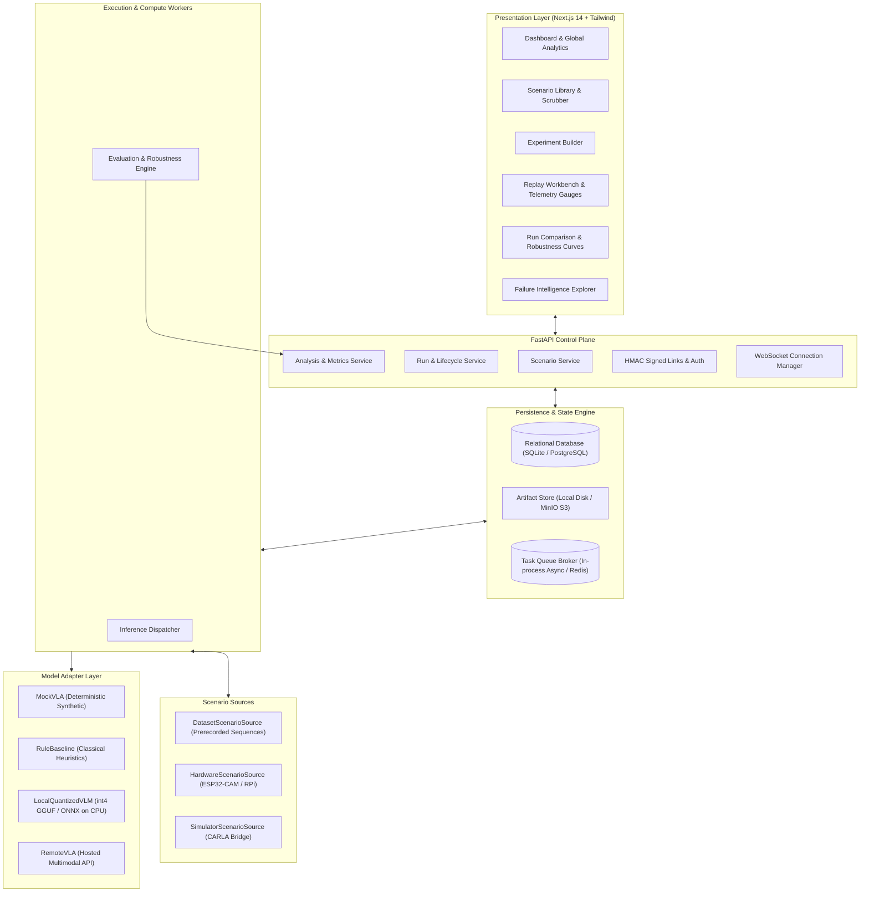
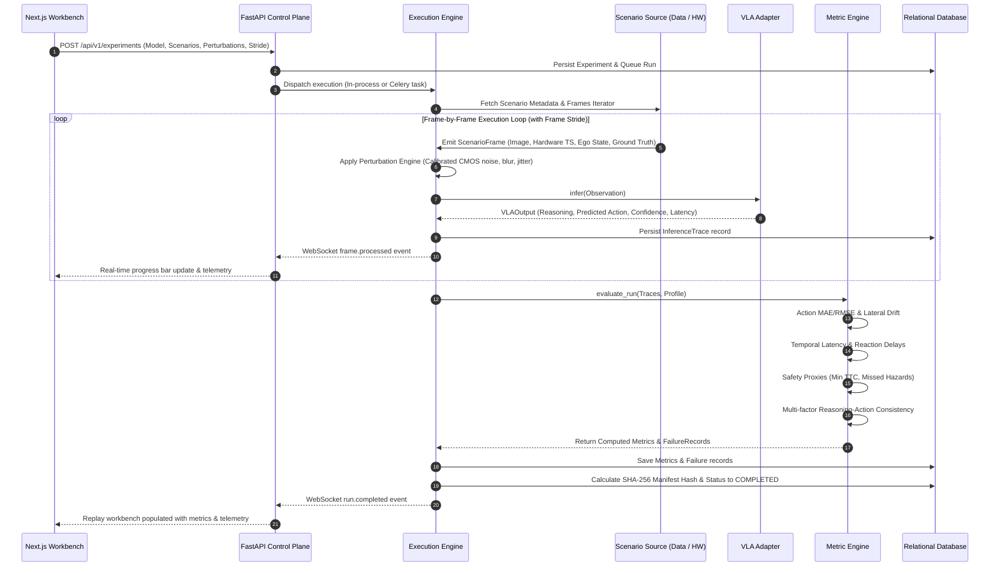
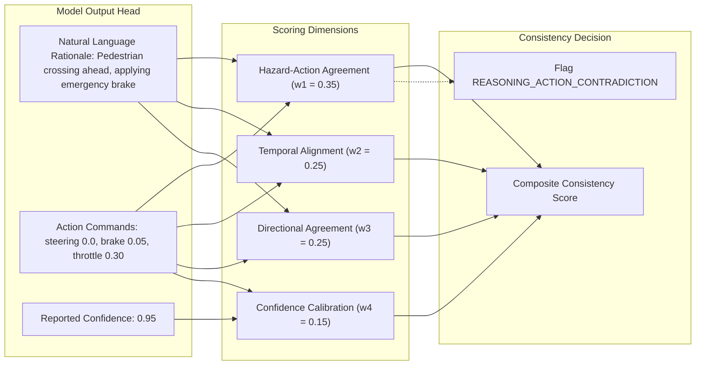
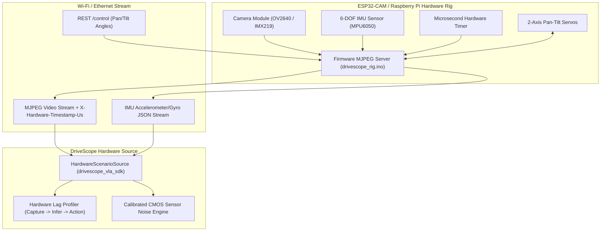
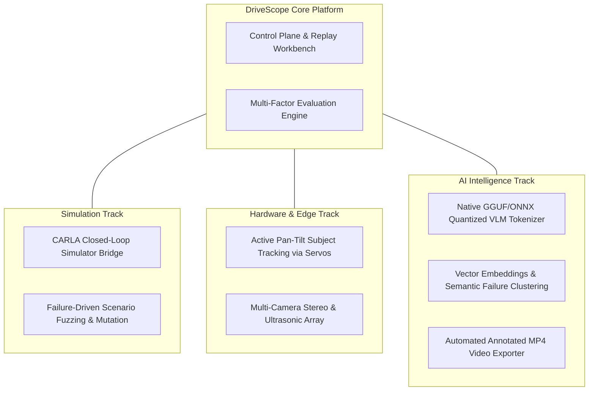

# DriveScope Architecture & System Design

This document details the software architecture, protocol contracts, dataflow sequences, hardware integration specifications, and state machines powering **DriveScope**.

---

## 1. Architectural Principles

1. **Protocol Decoupling**: Scenario data providers (`ScenarioSource`) and models (`VLAAdapter`) sit behind runtime interfaces. The database schema, metrics engine, and UI never depend on which model or data source is active.
2. **Dual-Engine Execution**: Ultra-lightweight `MODE=minimal` (SQLite + in-process queue) for modest hardware and laptops, alongside `MODE=docker` (PostgreSQL + Redis + Celery + MinIO) for multi-node production runs.
3. **Reproducibility by Design**: Every experiment execution generates a SHA-256 configuration hash and an immutable `RunManifest` tracking code version, scenario hash, seed, and evaluation outputs.
4. **Physical Sensor Calibration**: Sensor perturbations model real CMOS sensor physics (Poisson shot noise + dark current read noise + rolling shutter skew) rather than arbitrary noise.

---

## 2. Layered Architecture Diagram

  

---

## 3. End-to-End Evaluation Sequence

---

## 4. Reasoning-Action Consistency Engine

$$\text{Consistency} = 0.35 \cdot S_{\text{hazard}} + 0.25 \cdot S_{\text{temp}} + 0.25 \cdot S_{\text{dir}} + 0.15 \cdot S_{\text{conf}}$$

---

## 5. Hardware Sensor Rig Architecture (ECE Core)

---

## 6. Future Ecosystem & Roadmap Extensions

